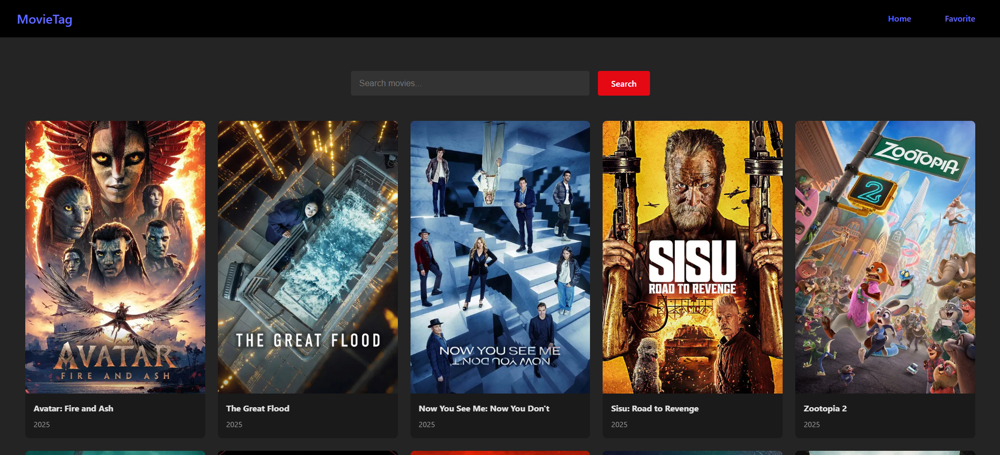

MovieTag
========

MovieTag is a simple React app that lets you explore movies and organize them with your own tags.  
It uses **The Movie Database (TMDB)** API to fetch real movie data.

---



1. Features
-----------

- **Browse movies** from TMDB.
- **Search movies** by title.
- **Tag movies** (for example: “Favorites”, “Watch Later”, “Comedy”).
- **Simple and clean UI** that works on desktop and mobile.

---

2. Tech Stack
-------------

- **Framework**: React  
- **Language**: JavaScript (or TypeScript, if you use it)  
- **API**: TMDB (The Movie Database)  

---

3. TMDB API Key Setup
---------------------

1. Go to the TMDB website and create an account.  
2. Create an API key from your TMDB account settings.  
3. In your project root, create a file named `.env` (if it doesn’t exist).  
4. Add your TMDB API key to the `.env` file, for example:

```env
VITE_TMDB_API_KEY=YOUR_TMDB_API_KEY_HERE
```

5. In your React code, read the key (example for Vite):

```js
const API_KEY = import.meta.env.VITE_TMDB_API_KEY;
```

> If you use Create React App instead of Vite, name it like `REACT_APP_TMDB_API_KEY` and use `process.env.REACT_APP_TMDB_API_KEY`.

**Important**: Never commit your real API key to GitHub. Keep `.env` in `.gitignore`.

---

4. Getting Started
------------------

1. **Install dependencies**

```bash
npm install
# or
yarn install
```

2. **Run the app**

```bash
npm run dev
# or
npm start
```

3. Open your browser at `http://localhost:3000` (or the port shown in your terminal).

---

5. Scripts (example)
--------------------

Common scripts in `package.json` (may vary):

- **`npm run dev` / `npm start`**: Start development server.
- **`npm run build`**: Build production bundle.
- **`npm test`**: Run tests (if configured).

---

6. Folder Structure (example)
-----------------------------

```text
src/
  components/
  pages/
  hooks/
  utils/
  assets/
README.md
package.json
```

---
